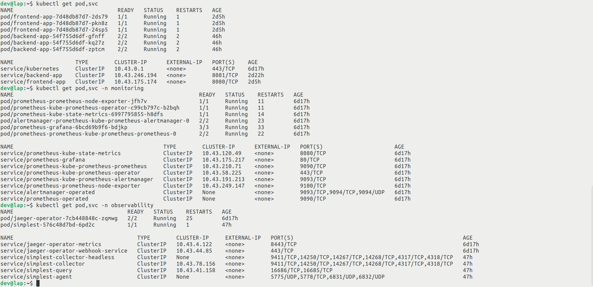

## Verify the monitoring installation

*TODO:* run `kubectl` command to show the running pods and services for all components. Take a screenshot of the output and include it here to verify the installation

## Setup the Jaeger and Prometheus source
*TODO:* Expose Grafana to the internet and then setup Prometheus as a data source. Provide a screenshot of the home page after logging into Grafana.

## Create a Basic Dashboard
*TODO:* Create a dashboard in Grafana that shows Prometheus as a source. Take a screenshot and include it here.

## Describe SLO/SLI
*TODO:* Describe, in your own words, what the SLIs are, based on an SLO of *monthly uptime* and *request response time*.

SLIs (Service Level Indicators) are metrics used to measure the performance of a service against its SLO (Service Level Objective). In this case, the SLIs would be the monthly uptime and request response time. Uptime would be measured as a percentage of time the service is available for use, and request response time would be measured as how quickly the service responds to requests from users.

## Creating SLI metrics.
*TODO:* It is important to know why we want to measure certain metrics for our customer. Describe in detail 5 metrics to measure these SLIs. 

1. Availability: This metric measures the percentage of time that a service is available to users. It can be measured by tracking the number of requests that are successfully completed and dividing it by the total number of requests made over a certain period of time.

2. Response Time: This metric measures how long it takes for a request to be processed and responded to. It can be measured by tracking the amount of time it takes for each request to be completed from start to finish.

3. Error Rate: This metric measures the percentage of requests that failed due to an error or other issue with the service. It can be measured by tracking the number of failed requests compared to the total number of requests made over a certain period of time.

4. Throughput: This metric measures how many requests can be processed in a given amount of time, such as per second or minute. It can be measured by tracking the number of successful requests completed over a certain period of time divided by that same period’s duration (seconds or minutes). 

5. Latency: This metric measures how long it takes for data to travel from one point in a system to another, such as from server to client or vice versa. It can be measured by tracking how long it takes for each request or response packet to travel between two points in a system over a certain period of time.

## Create a Dashboard to measure our SLIs
*TODO:* Create a dashboard to measure the uptime of the frontend and backend services We will also want to measure to measure 40x and 50x errors. Create a dashboard that show these values over a 24 hour period and take a screenshot.

## Tracing our Flask App
*TODO:*  We will create a Jaeger span to measure the processes on the backend. Once you fill in the span, provide a screenshot of it here. Also provide a (screenshot) sample Python file containing a trace and span code used to perform Jaeger traces on the backend service.

## Jaeger in Dashboards
*TODO:* Now that the trace is running, let's add the metric to our current Grafana dashboard. Once this is completed, provide a screenshot of it here.

## Report Error
*TODO:* Using the template below, write a trouble ticket for the developers, to explain the errors that you are seeing (400, 500, latency) and to let them know the file that is causing the issue also include a screenshot of the tracer span to demonstrate how we can user a tracer to locate errors easily.

TROUBLE TICKET

Name: Backend "status_code 400"

Date: January 23 2023, 10:18 AM

Subject: Mogogdb operator not respond

Affected Area: Backend service 

Severity: Critical

Description: The endpoint http://localhost:8081/star for add_star service not working we need to check both the backend connection to monogdb and monogdb deployment in the cluster.

## Creating SLIs and SLOs
*TODO:* We want to create an SLO guaranteeing that our application has a 99.95% uptime per month. Name four SLIs that you would use to measure the success of this SLO.

1. Total number of minutes the application is available per month
2. Total number of requests served per month
3. Average response time for requests
4. Number of outages per month

## Building KPIs for our plan
*TODO*: Now that we have our SLIs and SLOs, create a list of 2-3 KPIs to accurately measure these metrics as well as a description of why those KPIs were chosen. We will make a dashboard for this, but first write them down here.

1. Availability: The percentage of time the system is available and accessible by customers. This KPI will help us measure how often our SLIs are being met and how reliable our system is for customers.

2. Response Time: The amount of time it takes for the system to respond to a customer request or query. This KPI will help us measure how quickly our SLOs are being met and provide insight into user experience.

3. Error Rate: The percentage of requests or queries that fail or return an error code. This KPI will help us measure how often our SLIs are not being met, giving us insight into potential issues with the system that need to be addressed.

## Final Dashboard
*TODO*: Create a Dashboard containing graphs that capture all the metrics of your KPIs and adequately representing your SLIs and SLOs. Include a screenshot of the dashboard here, and write a text description of what graphs are represented in the dashboard.

1. Total successful requests per minute: Measure Number of successful "200" backend and frontend requests per miute.

2. Total requests per minute: Measure Number of requests 20x, 30x, 40x and 50x backend and frontend requests per miute.

3. Average response time per path: The average response time measured over 1m intervals for successful requests. Shown per path.

4. Errors per minute: Measure Number of failed (non HTTP 200) responses per second.

5. CPU usage: Measure cpu usage of the backend and frontend app as measured over 1 seconds intervals.

6. Memory usage: Measure memory usage of the backend and frontend app as measured over 1 seconds intervals.